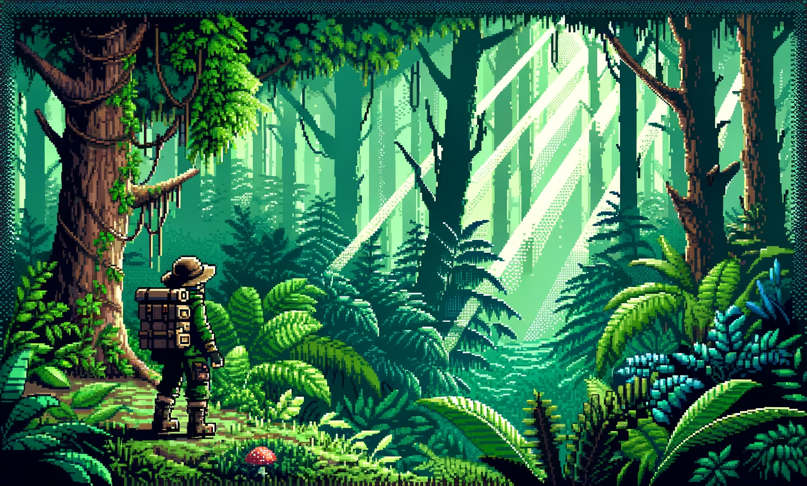

# Klaytn DApp Toolkit 🧰

> Start your web3 journey on Klaytn with a complete DApp toolkit

**Klaytn DApp Toolkit** takes an unopinionated approach to DApp development. Instead of forcing you to adopt our tech stack of choice, we provide you with code snippets that you can use to copy and paste into whichever framework/technical stack that you are using. You can always refer to the original framework documentation for troubleshooting as well as our Troubleshooting section for each component.

The included smart contract templates and front-end sample codes aim to provide you with everything you need to run a web product, along with additional tools, documentation, and tricks for building onchain.

Whether you're a hackathon participant or an ambitious entrepreneur looking to establish the next successful project, this toolkit is designed with you in mind.

## Getting started
### Docs folder
Read the [docs](/docs/) in the repository for complete

### Contracts folder
Contains many complete smart contract implementations of various DApps

### Frontend folder
Contains implementation details of various frontend frameworks for EVM and guide to implement Klaytn specific features with copy/paste code samples

### Docker
placeholder

## FAQ
### Why copy/paste and not packaged as a container app?
The idea behind this is to give you ownership and control over the code, allowing you to decide how the components of your DApp are built.

Start with some sensible defaults, then customize all the codes to your needs.

One of the drawback of other opinionated tools is that they often stick to one technical stack which might not fit for everyone.

### Do you plan to publish it as a container app?
Not at the moment.

### Which frameworks are supported?
You can use any development framework that supports EVM. For example, [Hardhat](https://hardhat.org), [Foundry](https://getfoundry.sh/), [Wagmi](https://wagmi.sh/), [Thirdweb](https://thirdweb.com/). You can also use dedicated toolings released by the Klaytn Foundation [here](https://github.com/klaytn)