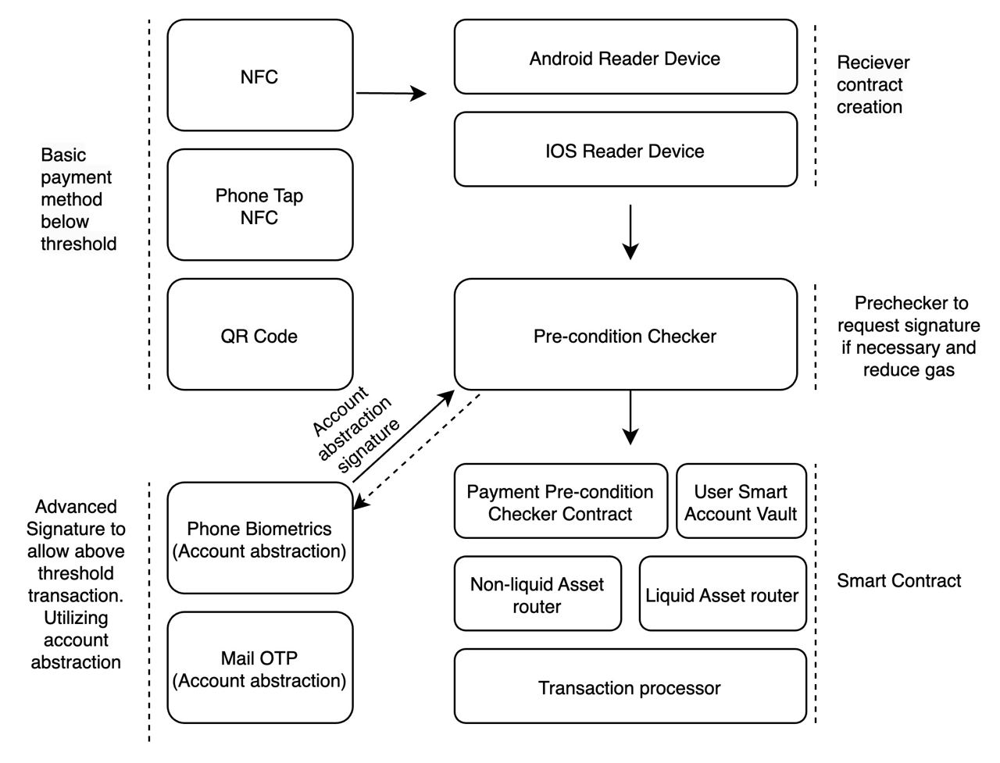

# Viction NFC Payment
Indexer and Core Settlement for Payment System

## NFC Payment Architecture

NFC Payment leverages Near-Field Communications (NFC) and Account Abstraction to create a payment gateway integrating cryptocurrency through card, phone tab or QR-Code.

### POS Contract

The **POS** contract manages payment requests when a user taps their NFC-enabled card. The POS device, whether an Android or iOS reader, receives contract information from the user, including a signature signed by the ephemeral key on the NFC card and payment details. This data is encoded and passed to the Pay function in the Vault Contract.

### Vault Contract

- **Deposit**: User deposits funds into the vault.
- **Withdraw**: User withdraw funds from the vault.
- **setLimit**: User can set limit for regular payments, Note that when the transfer amount exceeds the set limit, the user's Account Abstraction will need to provide a reconfirmation signature.
- **Pay** function (called by **POS** contract)
    - If the transfer amount is within the limit user set on the **Vault** Contract, no reconfirmation signature is necessary.
    - If the transfer amount exceeds the set limit, the Account Abstraction of the user (via Phone Biometrics or Mail OTP) must provide a reconfirmation signature to complete the transaction.

### Swap Contract

The Swap contract simulates a decentralized exchange (DEX) platform for swapping tokens in case the token the user possesses is different from the token required by the POS system. Examples of such platforms include Pancake Swap and Uniswap.

## Features

### Already Implemented
- NFC or Phone NFC tapping
- Pre-condition checker system for limit conditions
- Mail OTP for user Account Abstraction confirmation for exceeding the Vault-set limit
- User's Smart Account Vault
- QR-Code implementation
- Social recovery
- Gas less transactions
- Spending limits
- Liquid and non-liquid asset router

### In The Future

- Transactions batching
- Biometric Authentication
- Integration with DeFi Protocols
- Privacy Features (zk Proof)

## Deployment
### BSC Testnet

-   `Swap`: 0x8aB386e5507c0B97a9b398641F0C3d6D90bD82B8
-   `POS`: 0x0DBb0069A7684E2DB1b9962F22Afdc6eB61F43b0
-   `Vault`: 0x0731fE55F95B5b986F4EBd187315fB1F4C823b94

### Viction testnet 

-   `Swap`: 0x138A20058F977B96c63306C1cC910339dC2301Fa
-   `POS`: 0xCefe4a5123b8b683dA995E2031053cb93079e909
-   `Vault`: 0x56dEAdD2Cda0193116c34975a041c261bFCCC981
